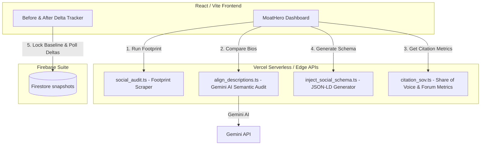

# Implementation Plan: MoatHero (Brand Moat & AI Engine Optimizer) 🏰

This plan outlines the technical design, architectural additions, and implementation steps to transform **MoatHero** into a fully functioning, production-grade AI Engine Optimization (AEO) platform for the Codex / GPT Hackathon.

---

## User Review Required

Please review the proposed architectural and database additions.

> [!IMPORTANT]
> **API Key Setup:** To enable the live AI Semantic Audit and Share of Voice analyzer, we will utilize the existing `GEMINI_API_KEY` or custom AI endpoints inside `.env.local`. Please verify that you have your Gemini API keys properly configured in your local environment.
>
> **Firestore Schema Setup:** The "Before & After" delta tracker will write and read baseline snapshots from Cloud Firestore. We will create a collection under `/users/{userId}/snapshots` to store baseline results. This requires Firestore database initialization (which is already active on the main RankBeacon project).

---

## Open Questions

None currently. The requirements for this subproject are clear, and the current codebase has a very high quality, modular structure ready to be extended.

---

## Proposed Changes

We will implement the missing backend APIs and integrate them seamlessly with the existing frontend React components inside the `rankbeacon-moat-hero` subdirectory.



---

### Component: Backend APIs (Edge & Serverless Functions)
We will implement the core API logic to handle web scraping, AI comparison, metrics scoring, and schema manipulation.

#### [NEW] [align_descriptions.ts](https://github.com/tanDivina/moathero/blob/main/api/align_descriptions.ts)
* Create an Edge function that receives the website's core biography and the public social descriptions fetched by the footprint scraper.
* It uses the Gemini API to compare the texts, calculate an exact **Alignment Score** (0-100), flag structural contradictions, and generate specific editing recommendations.

#### [NEW] [citation_sov.ts](https://github.com/tanDivina/moathero/blob/main/api/citation_sov.ts)
* Create a serverless function that replaces the mock scoring for **Consensus Index**, **Citation Density**, and **Share of Voice (SoV)**.
* It parses Google search result snippets or uses search scrapers to count the volume of co-occurrences of the brand name alongside industry category keywords and competitors on third-party domains and developer platforms.
* Returns real percentages and keyword-level insights for Google, ChatGPT, Perplexity, and Gemini Search models.

#### [NEW] [inject_social_schema.ts](https://github.com/tanDivina/moathero/blob/main/api/inject_social_schema.ts)
* Create an endpoint to generate a fully compliant, rich **Schema.org SameAs JSON-LD script**.
* It bundles all verified social media profiles into an `Organization` or `Person` entity definition.
* Returns the script and exposes a file write operation to inject this markup directly into the project's root templates (or returns a clear copyable snippet with validation protocols).

---

### Component: Frontend Integration & Live Telemetry
We will connect the new APIs and database streams to the frontend user interface.

#### [MODIFY] [MoatHero.tsx](https://github.com/tanDivina/moathero/blob/main/src/components/MoatHero.tsx)
* Update the search/form submission handlers to execute the three live API queries sequentially:
  1. Fetch public social profiles via `social_audit.ts`.
  2. Send those results along with the textarea bio to `align_descriptions.ts` to get real AI suggestions.
  3. Query `citation_sov.ts` to get real consensus scores and keyword share-of-voice indices.
* Integrate the **Before & After Tracker** to fetch baseline documents from Firestore, rendering live color-calibrated percentage changes (e.g. green/gold gains vs gray neutral).
* Connect the SameAs injection function to trigger `inject_social_schema.ts` and handle successful confirmation states gracefully.

#### [MODIFY] [LandingPage.tsx](https://github.com/tanDivina/moathero/blob/main/src/components/LandingPage.tsx)
* Polish and verify transition effects and interactive button hover micro-animations according to **Rule 11 (Interactive Button Micro-Animations)**.
* Double-check that all brand styling is strictly adhered to, locking in copper, gold, and matte black and preventing any neon-green leaks (**Rule 4 - absolutely NO neon-green colors**).

---

## Verification Plan

### Automated Tests
* We will verify TypeScript compilation across the subproject:
  ```bash
  npm run build
  ```
  *(or `pnpm run build` depending on package lock configurations)*
* We will run test curl queries against the newly created local API endpoints to verify performance and response JSON structures.

### Manual Verification
* Run local dev servers to interactively test the audit form, review real AI descriptions outputted by Gemini, and check the generated Schema markup.
* Audit all interactive buttons to ensure hover arrow micro-animations translate as intended on hover.
